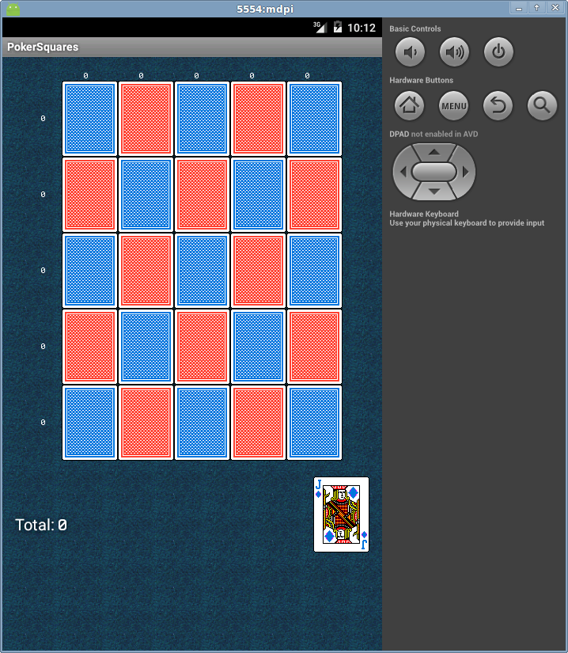
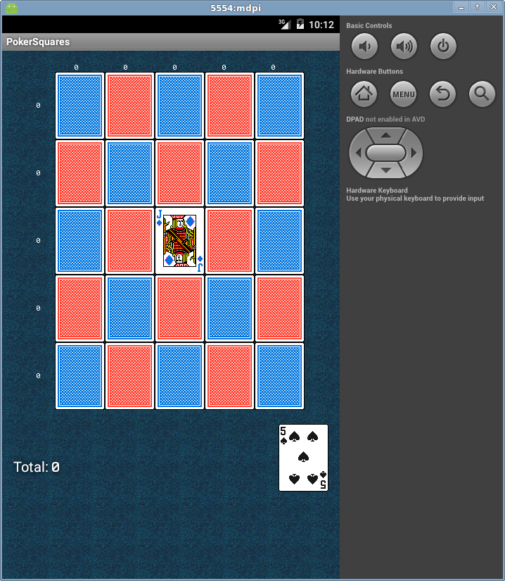
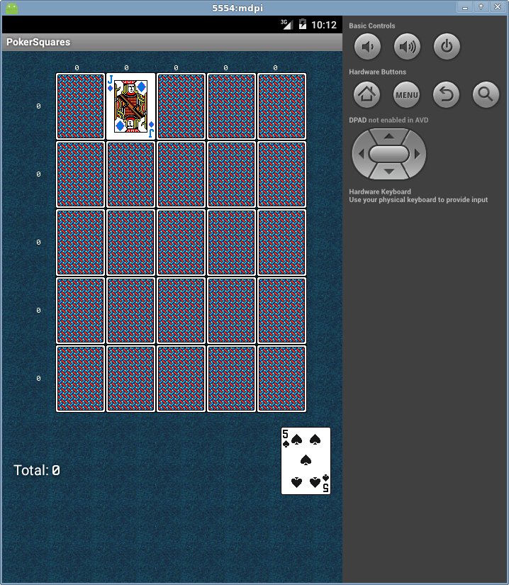
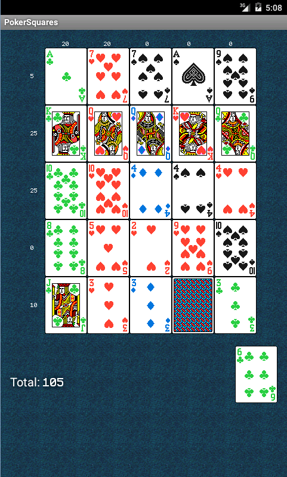

Poker Squares
-------------------------------
This is a Gettysburg College ACM chapter project. It is an android application version of the game Poker Squares. Contributors to this project include John Duncan, Professor Todd Neller, and all of the students who collaborated on the PokerSquares AI player during the Poker Squares AI competition which took place in the Spring 2013 semester at Gettysbug College.

Features
-------------------------------

* Minimal Application Size
* Simple yet intuitive game controls
* No advertisements or bloat
* Cool animations
* Expert AI player that plays alongside you

APK Download
-------------------------------

Get it [here](https://github.com/JohnDDuncanIII/PokerSquares/blob/master/bin/PokerSquares.apk).

Current Development Screenshots
-------------------------------

Sources
-------------------------------
### [Playing Cards](http://www.jfitz.com/cards/)
### [My playing cards (Edited)](http://cs.gettysburg.edu/~duncjo01/PlayingCards/)
### [Color Scheme Used for Playing Cards](http://clrs.cc/)